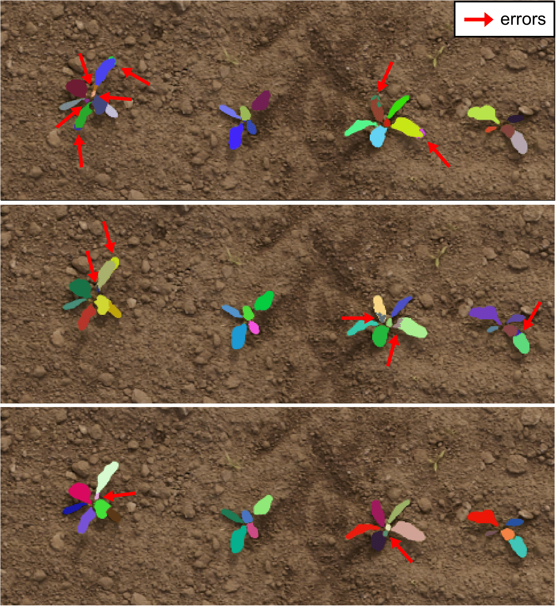

# On Domain-Specific Pre-Training for Effective Semantic Perception in Agricultural Robotics

This repo contains the code of the paper *On Domain-Specific Pre-Training for Effective Semantic Perception in Agricultural Robotics*, by [G. Roggiolani](https://github.com/theroggio) et al., accepted to the IEEE International Conference on Robotics and Automation (ICRA) 2023.

## Abstract 

Agricultural robots have the prospect to enable more efficient and sustainable agricultural production of food, feed, and fiber. Perception of crop and weed is a central component of agricultural robots that aim to monitor fields and assess the plants as well as their growth stage in an automatic manner. Semantic perception mostly relies on deep learning using supervised approaches, which require time and qualified workers to label fairly large amounts of data. In this paper, we look into the problem of reducing the amount of labels without compromising the final segmentation performance. For robots operating in the field, pre-training networks in a supervised way is already a popular method to reduce the number of required labeled images. We investigate the possibility of pre-training in a self-supervised fashion using data from the target domain. To better exploit this data, we propose a set of domain-specific augmentation strategies. We evaluate our pre-training on semantic segmentation and leaf instance segmentation, two important tasks in our domain. The experimental results suggest that pre-training with domain-specific data paired with our data augmentation strategy leads to superior performance compared to commonly used pre-trainings. Furthermore, the pre-trained networks obtain similar performance to the fully supervised with less labeled data.

## Results
Quantitative results of our method against different pre-training methods and using progressively less annotated images for the fine-tuning. The first table presents the result on the semantic segmentation task, where the percentage of labels (100 - 50 - 25 - 10 - 1) correspond to 1.450, 724, 362, 140 and 14 images.  

| Method                          | Labels [%] | mIoU (soil - crop - weed) [%] |
|---------------------------------|:----------:|-------------------------------|
| without pre-training            | 100        | 70.6                        |
| ImageNet pre-training           |            | 78.8                   |
| pre-training on domain data     |            | 78.3                   |
| our                             |            | **81.8**                   |
| without pre-training            | 50        | 69.6                        |
| ImageNet pre-training           |            | 74.4                   |
| pre-training on domain data     |            | 75.8                   |
| our                             |            | **76.7**                   |
| without pre-training            | 25        | 62.6                        |
| ImageNet pre-training           |            | 70.7                   |
| pre-training on domain data     |            | 73.0                   |
| our                             |            | **73.3**                   |
| without pre-training            | 10        | 48.6                        |
| ImageNet pre-training           |            | 48.1                   |
| pre-training on domain data     |            | 64.1                   |
| our                             |            | **67.9**                   |
| without pre-training            | 1        | 44.2                        |
| ImageNet pre-training           |            | 22.4                   |
| pre-training on domain data     |            | 44.7                   |
| our                             |            | **49.1**                   |

The second table presents the result on the leaf instance segmentation task, where the percentage of labels (100 - 50 - 25 - 10 - 1) correspond to 746, 373, 186, 74 and 7 images. 
| Method                          | Labels [%] | AP\_{plants} | AR\_{plants} | AP\_{leaves} | AR\_{leaves} | 
|---------------------------------|:----------:|-------------|----------|---------|------------------|
| without pre-training            | 100        | 54.3 | 60.5 | 48.7 | 68.3           |
| ImageNet pre-training           |            | 55.1 | 61.2 | 59.7 | 68.9                   |
| our                             |            | **55.6** | **62.9**| **64.4**| **69.2**   |
| without pre-training            | 50        | 50.3 | 59.0 | 45.6 | 60.1                        |
| ImageNet pre-training           |            | 52.4 | 60.1 | 52.7 | 61.5 |
| our                             |            | **54.6** | **60.8**| **54.6**| **62.7**                   |
| without pre-training            | 25        | 48,.0 | 55.2 | 42.0 | 46.1                        |
| ImageNet pre-training           |            | 50.2 | 56.1 | 50.6 | 56.6                   |
| our                             |            | **50.9** | **56.9** | **53.8** | **60.6**                   |
| without pre-training            | 10        | 46.6 | 54.0 | 20.7 | 39.6                        |
| ImageNet pre-training           |            | 46.8 | 53.7 | 29.5 | 38.4                   |
| our                             |            | **48.0** | **54.2** | **42.5** | **49.2**                   |
| without pre-training            | 1        | 0.0 | 0.0| 0.1 | 0.3                        |
| ImageNet pre-training           |            | 0.0 | 0.0 | 0.4 | 0.2                   |
| our                             |            | **1.1** | **8.3** | **0.9** | **5.6**                  |


<br/>
Qualitative results of our method against baselines on the leaf instance segmentation task, where red arrows point to errors:



Check out the [paper](https://www.ipb.uni-bonn.de/wp-content/papercite-data/pdf/roggiolani2023icra-odsp.pdf) for more quantitative and qualitative results! :grin:


## Code
The `install.py` script provides a virtual environment (conda) to install the requirements and create a package. This allows us to import modules and functions like every other package:

``` py
    import self_supervised_agrinet.stuff
```

### Personalize this code
To use this code with different datasets, configuration or backbones you need to:

1. Personalize the config.yaml
    * Write the correct path to your dataset
    * Define the characteristics of your training procedure - i.e. max number of epochs, learning rates and batch size
    * Define your model - i.e. backbone, dropout, projector network and embedding size

2. If your dataset has a different structure, re-write the datalaoder

3. In utils.py you can switch on/off the different augmentations or change their probabilities

4. Run the code just as ```python train.py```

Your weights will be saved in the experiments folder, together with the log file.

### How to use the weights
In the jupyter-notebook `downstream\_task\_example` you can find further instructions about how to load the weights into your network and implement your own downstream tasks.

## Citation
If you use our framework for any academic work, please cite the original [paper](https://www.ipb.uni-bonn.de/wp-content/papercite-data/pdf/roggiolani2023icra-odsp.pdf)!

```
@inproceedings{roggiolani2023icra-odsp,
author = {G. Roggiolani and F. Magistri and T. Guadagnino and G. Grisetti and C. Stachniss and J. Behley},
title = {{On Domain-Specific Pre-Training for Effective Semantic Perception in Agricultural Robotics}},
booktitle = icra,
year = 2023,
}
```

## Acknowledgment
This work has partially been funded by the Deutsche Forschungsgemeinschaft (DFG, German Research Foundation) under Germany's Excellence Strategy, EXC-2070 -- 390732324 -- [PhenoRob](https://www.phenorob.de/), and by the Deutsche Forschungsgemeinschaft (DFG, German Research Foundation) under STA 1051/5-1 within the FOR 5351(AID4Crops).
